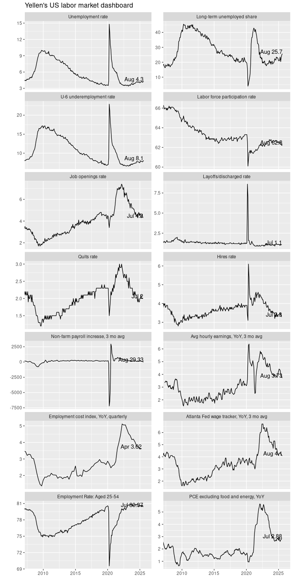

Yellen dashboard
================
Mitsuo Shiota
2019-03-19

  - [Summary](#summary)
  - [Libraries](#libraries)
  - [Self-made functions](#self-made-functions)
      - [tq\_diff function to get
        differences](#tq_diff-function-to-get-differences)
      - [tq\_ma function to get moving
        averages](#tq_ma-function-to-get-moving-averages)
      - [tq\_gr function to get growth
        rates](#tq_gr-function-to-get-growth-rates)
  - [Get data from FRED](#get-data-from-fred)
  - [Transform data](#transform-data)
  - [Get data from Atlanta Fed Wage Growth
    Trucker](#get-data-from-atlanta-fed-wage-growth-trucker)
  - [Combine data](#combine-data)
  - [Prepare for the plot](#prepare-for-the-plot)
  - [Dashboard](#dashboard)

Updated: 2019-06-10

## Summary

[Dashboard in pdf](output/Yellen.pdf)

This is a pilot project to utilize R language and tidyquant package for
economic analysis.

I read the bloomberg article, [“Yellen’s Labor Market
Dashboard”](https://www.bloomberg.com/graphics/2015-yellens-labor-market-dashboard/),
and found 12 time-series data, central bankers are supposed to watch. I
decided to replicate this dashboard. I added PCE, excl food and energy,
to see price stability. Update: I also added prime age employment rate,
as it is said to be more closely related to wage than headline
(un)employment rate.

## Libraries

I use tq\_get function from tidyquant package to get tidy data from
[Federal Reserve Bank of St. Louis
(FRED)](https://fred.stlouisfed.org/). And some of my self-made
functions depend on tidyquant package.

I use GET function from httr package to get an excel file from [Federal
Reserve Bank of Atlanta (Wage Growth
Tracker)](https://www.frbatlanta.org/chcs/wage-growth-tracker.aspx), and
readxl package to read excel data.

``` r
library(tidyquant)
library(httr)
library(readxl)
```

## Self-made functions

tidyquant package assumes tidy data, basically a data frame of long
format, of 3 columns: “date”, “symbol” and “price.” These column names
come from stock price analysis. Based on this assumption, I have made
functions to transform values in price column.

### tq\_diff function to get differences

tq\_diff function puts differences from n period ago in price column. I
set the default value of parameter n as 1. In monthly data, tq\_diff(df)
gets differences from the prior month.

``` r
tq_diff <- function(df, n = 1) {
  df %>% 
    group_by(symbol) %>% 
    mutate(
      price_lag = lag(price, n),
      price = price - price_lag
    ) %>% 
    ungroup() %>% 
    select(-price_lag)
}
```

### tq\_ma function to get moving averages

tq\_ma function puts n period moving averages in price column. I set the
default value of parameter n as 3. In monthly data, tq\_ma(df) gets 3
month moving average.

``` r
tq_ma <- function(df, n = 3) {
  df %>% 
    group_by(symbol) %>% 
    tidyquant::tq_mutate(
      select = price,
      mutate_fun = SMA,
      n = n
    ) %>% 
    ungroup() %>% 
    rename(
      foo = price,
      price = SMA
    ) %>% 
    select(-foo)
}
```

### tq\_gr function to get growth rates

tq\_gr function puts growth rates from n period ago in price column. I
set the default value of parameter n as 12. In monthly data, tq\_gr(df)
gets year-over-year growth rates.

Parameter annualize is used to power growth rates. In quarterly data,
like seasonally-adjusted GDP, set n = 1 and annualize = 4, and you can
get annualized growth rates.

``` r
tq_gr <- function(df, n = 12, annualize = 1) {
  df %>% 
    group_by(symbol) %>% 
    mutate(
      price_lag = lag(price, n),
      price = (price / price_lag)^annualize * 100 - 100
    ) %>% 
    ungroup() %>% 
    select(-price_lag)
}
```

## Get data from FRED

At [FRED](https://fred.stlouisfed.org/), I searched data, and got
symbols from the parentheses in the title. For example, if the title is
“Japan / U.S. Foreign Exchange Rate (AEXJPUS)”, “AEXJPUS” is the
symbol.

``` r
yellen_labor_mkt_symbols <- c(
  "UNRATE", # Unemployment rate
  "U6RATE", # U-6, underemployment rate
  "LNS13025703", # Long-term unemployed share
  "PAYEMS", # Non-farm payrolls, total
  "JTSJOR", # Job openings rate
  "JTSLDR", # Layoffs/discharged rate
  "JTSQUR", # Quits rate
  "JTSHIR", # Hires rate
  "CEU0500000003", # Average hourly earnings, total private
  "ECIALLCIV", # Employment cost index, all civilians, quaterly
  "CIVPART", # Labor force participation rate
  "LREM25TTUSM156S", # Employment Rate: Aged 25-54: All Persons
  "PCEPILFE" # PCE excluding food and energy
  ) 
```

I set the first date to get data as START. I also set XLIM, x axis
limits, to plot later.

``` r
START = "2006-01-01"

XLIM <- c(as.Date("2008-01-01"), as.Date("2019-12-01"))
```

Now I can use tq\_get function from tidyquant package to download data
from FRED.

``` r
labor_mkt_m <- yellen_labor_mkt_symbols %>% 
  tq_get(get = "economic.data", from = START)
```

## Transform data

Non-farm payrolls requires the most complicated transformation. I have
to take differences from the prior month, and make them 3 month moving
average. Fortunately pipe operator helps
me.

``` r
# transform Non-farm payrolls, total to differences, 3 month moving average
payems <- labor_mkt_m %>% 
  filter(symbol == "PAYEMS") %>% 
  tq_diff() %>% 
  tq_ma(n = 3)
```

I transform PCE to year-over-year growth rates, average hourly earnings
to year-over-year growth rates and 3 month moving average, and
employment cost index, quarterly data, to year-over-year growth rates.

``` r
# transform PCE to growth rates, YoY
pce <- labor_mkt_m %>% 
  filter(symbol == "PCEPILFE") %>% 
  tq_gr(n = 12)

# transform Average hourly earnings to YoY, 3 ma
ceu <- labor_mkt_m %>% 
  filter(symbol == "CEU0500000003") %>% 
  tq_gr(n = 12) %>% 
  tq_ma(n = 3)

# transform Employment cost index, quarterly data to YoY
eci <- labor_mkt_m %>% 
  filter(symbol == "ECIALLCIV") %>% 
  tq_gr(n = 4)
```

## Get data from Atlanta Fed Wage Growth Trucker

There is one datum I can’t get from
[FRED](https://fred.stlouisfed.org/), that is [Atlanta Fed Wage
Tracker](https://www.frbatlanta.org/chcs/wage-growth-tracker.aspx).
Unfortunately I could not find API to get data. So, initially I manually
downloaded an excel file, transformed it into a csv file, and used
read\_csv to read.

Later, I found [“Read Excel file from a URL using the readxl
package”](https://stackoverflow.com/questions/41368628/read-excel-file-from-a-url-using-the-readxl-package)
in StackOverflow. Now, I automate the reading process, though it is
awkward. If Atlanta Fed changes something, this part will
fail.

``` r
url <- "https://www.frbatlanta.org/-/media/documents/datafiles/chcs/wage-growth-tracker/wage-growth-data.xlsx"

GET(url, write_disk(tf <- tempfile(fileext = ".xlsx")))
```

``` r
res <- read_excel(tf, col_names = FALSE, na = c(".", ""), skip = 2)

names(res)[1:2] <- c("date", "price")
res$date <- as.Date(res$date)

wage_tracker <- res %>% 
  select(date, price)
  
wage_tracker$symbol <- "WAGETR"
wage_tracker <- wage_tracker %>% 
  filter(date >= START)
```

## Combine data

I combine transformed data with not-transformed data, and get tidy data.

``` r
labor_mkt <- labor_mkt_m %>% 
  filter(!(symbol %in% c("PAYEMS", "PCEPILFE", "CEU0500000003", "ECIALLCIV"))) %>% 
  bind_rows(payems) %>% 
  bind_rows(pce) %>% 
  bind_rows(ceu) %>% 
  bind_rows(eci) %>% 
  bind_rows(wage_tracker)
```

## Prepare for the plot

I change class of symbol from character to factor in the appropriate
order for the plot.

``` r
labor_mkt$symbol <- factor(labor_mkt$symbol,
                           levels = c("UNRATE", "LNS13025703", "U6RATE", "CIVPART",
                                      "JTSJOR", "JTSLDR", "JTSQUR", "JTSHIR",
                                      "PAYEMS", "CEU0500000003", "ECIALLCIV", "WAGETR",
                                      "LREM25TTUSM156S", "PCEPILFE"))
```

I recode symbol to make them more readable in the plot.

``` r
labor_mkt <- labor_mkt %>% 
  mutate(
         symbol = fct_recode(symbol,
                             "Unemployment rate" = "UNRATE",
                             "Long-term unemployed share" = "LNS13025703",
                             "U-6 underemployment rate" = "U6RATE",
                             "Labor force participation rate" = "CIVPART",
                             "Job openings rate" = "JTSJOR",
                             "Layoffs/discharged rate" = "JTSLDR",
                             "Quits rate" = "JTSQUR",
                             "Hires rate" = "JTSHIR",
                             "Non-farm payroll increase, 3 mo avg" = "PAYEMS",
                             "Avg hourly earnings, YoY, 3 mo avg" = "CEU0500000003",
                             "Employment cost index, YoY, quarterly" = "ECIALLCIV",
                             "Atlanta Fed wage tracker, YoY, 3 mo avg" = "WAGETR",
                             "Employment Rate: Aged 25-54" = "LREM25TTUSM156S",
                             "PCE excluding food and energy, YoY" = "PCEPILFE"
                             )
           )
```

As I work with the PC, Windows 10, Japanese version, I have to set local
time locale to display months in English in the plot.

``` r
Sys.setlocale(category = "LC_TIME", locale = "C")
```

## Dashboard

OK. Let us plot. I add the labels at the latest. Some of them are put
ugly, but useful enough.

``` r
labor_mkt %>% 
  group_by(symbol) %>% 
  mutate(
    label = if_else(date == max(date), 
                    paste(lubridate::month(date, label = TRUE, abbr = TRUE),
                          as.character(round(price, 2))
                          , sep = " "),
                    NA_character_)
  ) %>% 
  ungroup() %>% 
  ggplot(aes(x = date, y = price)) + 
  geom_line() +
  facet_wrap(~ symbol, ncol = 2, scales = "free_y") +
  geom_text(aes(label = label), na.rm = TRUE,
            hjust = 1, vjust = 0) +
  coord_cartesian(xlim = XLIM) +
  labs(
    title = "Yellen's US labor market dashboard",
    x = "",
    y = "")
```

<!-- -->

Save plot in output/Yellen.pdf.

``` r
ggsave(filename = "output/Yellen.pdf",
       width = 8, height = 16, units = "in", dpi = 300)
```

EOL
